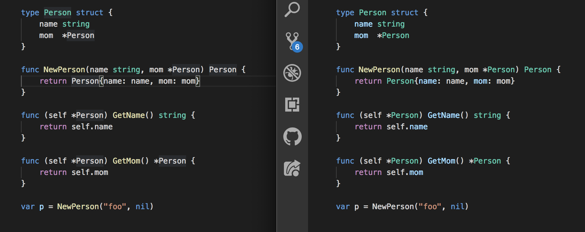
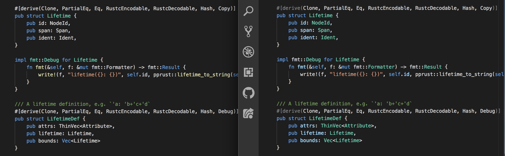
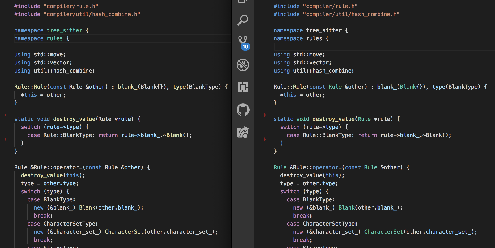
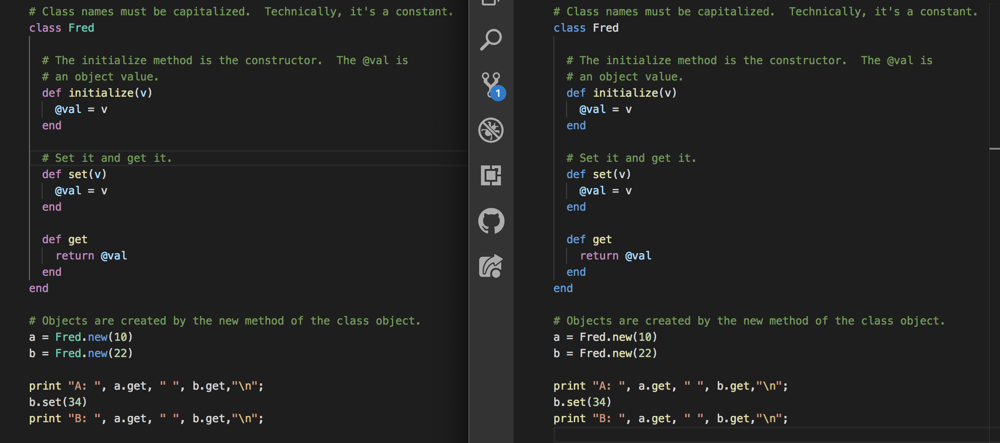
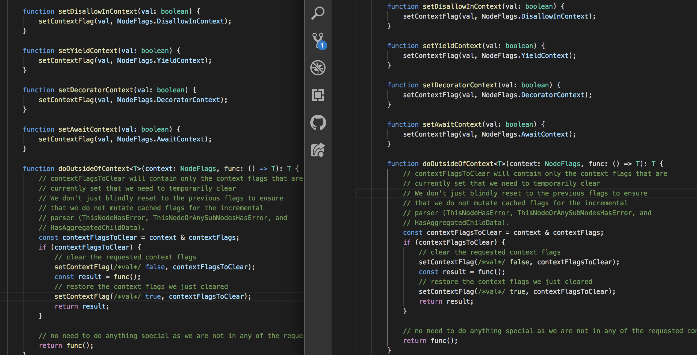

# Tree Sitter for VSCode

This extension gives VSCode support for [tree-sitter](http://tree-sitter.github.io/tree-sitter/) syntax coloring. Examples with tree-sitter coloring on the right:

## Go

## Rust

## C++

## Ruby

## Typescript

## Contributing

### Fixing colorization of an existing language

If you see something getting colored wrong, or something that should be colored but isn't, please make a PR to fix it! Colorization is performed by the various `colorLanguage(x, editor)` functions at the top of [extension.ts](https://github.com/georgewfraser/vscode-tree-sitter/blob/master/src/extension.ts). When working on the colorization rules, please keep in mind two core principles:

1. Good colorization is *consistent*. It's better to not color at all than to color inconsistently.
2. Good colorization is *selective*. The fewer things that we color, the more emphasis the color gives.

### Adding a new language

It's straightforward to add any [language with a tree-sitter grammar](https://tree-sitter.github.io/tree-sitter/).

1. Add a dependency on the npm package for that language: `npm install tree-sitter-yourlang`.
3. Add the language and color function to the [dictionary in ./lib/extension.ts](https://github.com/georgewfraser/vscode-tree-sitter/blob/758d5227dee704570125ea86a0a5ff2e0371a1e9/src/extension.ts#L172).
4. Add a **simplified** TextMate grammar to `./textmate/yourlang.tmLanguage.json`. The job of this textmate grammar is just to color keywords and literals.
5. Add a reference to the grammar to the [contributes.grammars section of package.json](https://github.com/georgewfraser/vscode-tree-sitter/blob/fb4400b78481845c6a8497d079508d28aea25c19/package.json#L26). `yourlang` must be a [VSCode language identifier](https://code.visualstudio.com/docs/languages/identifiers).
6. Add a reference to `onLanguage:yourlang` to the [activationEvents section of package.json](https://github.com/georgewfraser/vscode-tree-sitter/blob/fb4400b78481845c6a8497d079508d28aea25c19/package.json#L18). `yourlang` must be a [VSCode language identifier](https://code.visualstudio.com/docs/languages/identifiers).
7. Add an example to `examples/yourlang`.
8. Hit `F5` in VSCode, with this project open, to test your changes.
9. Take a screenshot comparing before-and-after and add it to the above list.
10. Submit a PR!